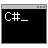

#  csharp-console

CLI REPL utility for evaluating C# statements and expressions and running short programs.

Useful for checking how a fragment of C# code might behave or what it returns, how long it takes to execute, or running some logic that you can write in a few lines but don't want to have to create a project and build to execute it.

This utility has evolved slowly over years of my need to quickly determine how a given C# statement behaves in various circumstances

# Download

Binary available for download at https://www.lsdwa.com/projects/csharp-console/

# Usage

Requires .Net Framework 4.0.

Syntax: 

```
cscon.exe [options] [c#-expression]
  --help       Display help
  --version    Display version
  -v           Enable verbose mode
  -t           Show Type information
  -F|--framework (version)    Use framework version (2.0, 3.5, 4.0)
  -R|--ref (ref)              Reference assembly (ref)
  -U|--using (using)          Add using section for namespace (using)
```

Executing `cscon` without an expression will open an interactive terminal where you can issue commands. If an expression is provided, it will be evaluated as a command, its output will be written to the terminal, and `cscon` will exit.

## Options

## Commands

```
Evaluation;
  e (code)           -- Evaluate statement and show output
  (code)             -- Execute code as written
  time (code)        -- Execute code and output run duration
  whileinput (code)  -- Execute code in a while loop, taking input
                        from the console to the variable 'input'
                        until input is blank
  verbose (on|off)   -- Enable/disable verbose mode
  typeinfo (on|off)  -- Enable/disable show type info
  
Program;
  (line-num) (line)  -- Set program line at line-num
  list               -- List current program with line numbers
  clear              -- Clear current program
  run                -- Run current program

Settings;
  framework (version)  -- Compile using specified framework version (defaults to v4.0)
  using (namespace)    -- Add namespace to using list
  listusing            -- List currently used namespaces
  clearusing           -- Clear current using list (resets to using System)
  ref (assembly)       -- Add assembly reference
  listref              -- List currently referenced assemblies
  clearref             -- Clear current reference list (resets to referencing System.dll)
```

## Code Expressions and Examples

Entering code in the terminal (or as the `expression` argument to `cscon`) will execute the given code and output the value it returns. If the statement does not return anything, it will instead output `null`.

Use the `e` command to evaluate an expression and show the output:

```
# e new DateTime(2019, 1, 5) - new DateTime(2018, 12, 10)
System.TimeSpan
26.00:00:00
```

```
# e Dns.GetHostEntry("www.google.com")
System.Net.IPHostEntry
System.Net.IPHostEntry(HostName="www.google.com", Aliases=[], AddressList=[System.Net.IPAddress(216.58.199.68)])
```

The `time` command will output the run duration of the code:

```
# time float x; for (int i = 0; i < Int32.MaxValue; i++) x = (float)i * (float)i;
null
Time 00:00:06.0950735
```

The `whileinput` command allows you to evaluate a statement against a variety of inputs, and ends when you enter a blank input:

```
# whileinput Console.WriteLine(string.Format("5 x {0} = {1}", input, 5 * int.Parse(input)));
while> 2
5 x 2 = 10
while> 5
5 x 5 = 25
while> 10
5 x 10 = 50
while> 14
5 x 14 = 70
while> 20
5 x 20 = 100
while>
null
```

Enter code with no command to run it as-is. Note that if your code does not return anything, and does not write any text to the console using `Console.WriteLine`, then only `null` will be displayed:

```
# var x = 2; var y = 5; var z = x + y; return z;
System.Int32
7
```

Code can also be entered across multiple lines as a single command by ending each non-terminating line with `\` backslash :

```
# var x = 2;\
# var y = 5;\
# var z = x + y;\
# return z;
System.Int32
7
```

Compilation errors will also be displayed, but the line/col numbers may not make any sense as the expression is internally wrapped in a program:

```
# e new DateTime(a, 0, 0)
COMPILE ERRORS
c:\Users\Luke\AppData\Local\Temp\0ih4pvrw.0.cs(11,31) : error CS0103: The name 'a' does not exist in the current contex
```

> **Note:** Evaulated statements and variables **do not** persist between commands, so you must declare and set all variables within a single command.

If you need to use a part of the framework that isn't in the default `using` list or isn't referenced, you can add namespaces or references using the `using` and `ref` commands. The following example references the framework assemblies and namespaces needed to take a screenshot of the primary display and save it to the desktop folder:

```
# ref System.Drawing.dll
Referenced System.Drawing.dll
# ref System.Windows.Forms.dll
Referenced System.Windows.Forms.dll
# using System.Drawing
Using System.Drawing
# using System.Drawing.Imaging
Using System.Drawing.Imaging
# using System.Windows.Forms
Using System.Windows.Forms
# var bounds = Screen.PrimaryScreen.Bounds; \
# var bmp = new Bitmap(bounds.Width, bounds.Height); \
# var g = Graphics.FromImage(bmp); \
# g.CopyFromScreen(bounds.X, bounds.Y, 0, 0, bounds.Size, CopyPixelOperation.SourceCopy); \
# var filename = DateTime.Now.ToString("yyyy-MM-dd-HH-mm-ss") + ".png"; \
# bmp.Save(Path.Combine(Environment.GetFolderPath(Environment.SpecialFolder.Desktop), filename), ImageFormat.Png);
null
```

By default, the used namespaces are:

```
System
System.IO
System.Net
System.Collections.Generic
```

and the referenced assemblies are:

```
System.dll
System.Collections.dll
```

## Line Editor

A simple numbered line editor is included to allow for writing and editing small programs. The returned value from these programs will be displayed in the same way as the command-less expressions above.

> **Note:** You still need to be aware of scopes and braces, so the syntax when using the line editor will likely end up looking a bit strange.

Take input and respond using the input values:

```
# 10 Console.Write("What is your name? ");
# 20 var name = Console.ReadLine();
# 30 Console.WriteLine("Hello, " + name +"!");
# 40 return name;
# run
What is your name? Luke
Hello, Luke!
System.String
"Luke"
```

Perform simple file listings or operations:

```
# 10 foreach (string file in Directory.GetFiles("C:\\Windows", "*.exe")) {
# 20 Console.WriteLine(string.Format("{0} is {1} KB", file, new FileInfo(file).Length / 1024));
# 30 }
# run
C:\Windows\explorer.exe is 3840 KB
C:\Windows\HelpPane.exe is 1030 KB
C:\Windows\hh.exe is 17 KB
C:\Windows\notepad.exe is 240 KB
C:\Windows\regedit.exe is 328 KB
C:\Windows\splwow64.exe is 127 KB
C:\Windows\Twunk_16.exe is 47 KB
C:\Windows\Twunk_32.exe is 68 KB
C:\Windows\winhlp32.exe is 11 KB
C:\Windows\write.exe is 11 KB
null
```

Or run a classic infinite loop:

```
# 10 loop:;
# 20 Console.Write("Hello World!");
# 30 goto loop;
# run
Hello World!Hello World!Hello World!Hello World!Hello World!Hello World!Hello World!... etc.
```

(The only way to break the above loop is to Ctrl-C or close the terminal, which will lose the program)
